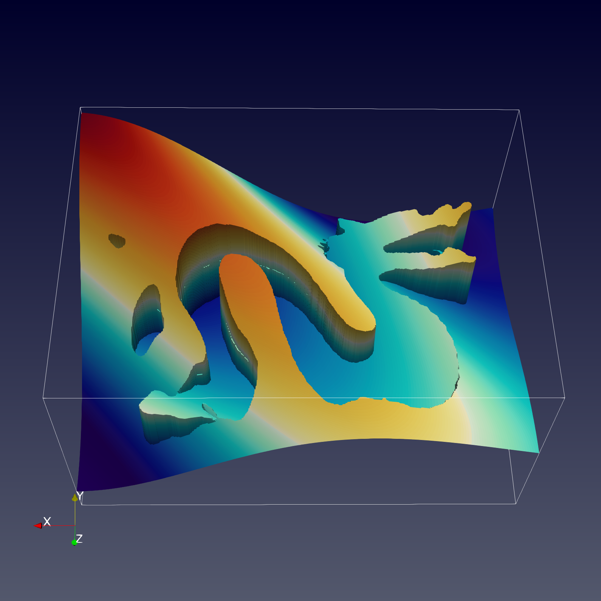

# JAX-DIPS
JAX implementation of a differentiable PDE solver with jump conditions across irregular interfaces in 3D.

JAX-DIPS implements the neural bootstrapping method (NBM):


Streamlines of solution gradients (left), and jump in solution (right) calculated by the `dragon` example.
<p float="center">
  
  
</p>

<!--  -->


<!-- Advection of the level-set function by a semi-Lagrangian scheme with Sussman reinitialization on a uniform mesh with `128*128*128` grid points is demonstrated below. Note the minimal mass-loss in the level-set function after a full rotation. -->
<!--  -->

<!--  -->

# Testing
Do `pytest tests/test_*.py` of each of the available tests from the parent directory:
- `test_advection`: a sphere is rotated 360 degrees around the box to replicate initial configuration. The L2 error in level-set function should be less than 1e-4 to pass. The advection is performed using semi-Lagrangian scheme with Sussman reinitialization.
- `test_reinitialization`: starting from a sphere level-set function with -1 inside sphere and +1 outside, we repeatedly perform Sussman reinitialization until the signed-distance property of the level-set is achieved. Center of the box should have level-set value equal to radius of the sphere, and corner of the box should be at a pre-specified distance to pass.
- `test_geometric_integrations`: integrating surface area of a sphere along with its volume. Small differences with associated theoretical values are expected to pass.
- `test_poisson`: tests for both the pointwise and the grid-based Poisson solvers over a star and a sphere interfaces. Note that in the current implementation the grid-based solver does not support batching and is therefore faster. Fixing this issue will be done in the future versions.
# Pre-requisites

## Nvidia Driver

```
apt install $(nvidia-detector)
```

## Docker Engine

Please refer https://docs.docker.com/engine/install/ubuntu/

## nvidia-docker2

Please refer https://nvidia.github.io/nvidia-docker/ to setup apt repo

apt-get install nvidia-docker2


# Development & Usage Environment

Docker images provide an isolated and consistent runtime environment, ensuring that the application behaves the same regardless of the host system. We recommend using the docker image provided here as it is fully loaded with libraries for datacenter scale simulatiopns and optimized for NVIDIA GPUs. For a full list of the supported software and specific versions that come packaged with this container image see the Frameworks Support Matrix https://docs.nvidia.com/deeplearning/frameworks/support-matrix/index.html


To personalize your development environment you need to set up a `.env` file that contains
```
IMAGE_NAME=docker.io/pourion/jax_dips:latest       # default docker image available for download! Change this if you want to build new docker images and push to your preferred docker registry
DATA_PATH=/data/                                   # default data path inside your docker container, will mirror your DATA_MOUNT_PATH directory
DATA_MOUNT_PATH=/data                              # default data mount path inside your machine, will mirror into your docker container's DATA_PATH directory
RESULT_PATH=/results/                              # default result path inside your docker container
RESULT_MOUNT_PATH=/results/                        # default result mount path inside your machine
REGISTRY=<your-preferred-registry-name>            # (optional) choices are docker.io (default), nvcr.io, ghcr.io, etc.
REGISTRY_USER=<your-registry-username>             # (optional) your username to connect to docker registry
REGISTRY_ACCESS_TOKEN=<your-registry-access-token> # (optional) your access token to connect to docker registry
WANDB_API_KEY=NotSpecified                         # (optional) your API key to connect to Weights and Biases service
JUPYTER_PORT=8888                                  # (optional) port to connect to jupyter server
```

## Pull development container
Currently the latest docker image available on Docker Hub is available at `docker.io/pourion/jax_dips`. Instead of building the container, you can only pull the latest docker image by running 

```
./launch.sh pull
```
which pulls from docker hub; i.e., equivalent to ```$ docker pull pourion/jax_dips:latest```.
## Build development container
Alternatively you can build the container by running the following command
```
./launch.sh build
```
In case you want to add additional libraries to your container this is the recommended way.


## Start developement container
This will create a container and places the user in the container with source code mounted. 

```
./launch.sh dev
```
Additionally, you can run the container in background without having your terminal jump into the container. This can be done by passing the `-d` flag for daemon:
```
./launch.sh dev -d
```

You can always attach your teminal to the running `jax_dips` container by

```
./launch.sh attach
```

### Development in VS Code 
Once the container is created and is running on your machine, user can attach to this container from VS code; i.e., you need to install Microsoft's `Dev Containers` extension in your VS Code, then `Ctrl+Shift+P` and choose `Dev Containers: Attach to Running Container...`, then choose the `jax_dips` container from the list of running containers on your machine.

## Cite JAX-DIPS
If you use JAX-DIPS in your research please use the following citations:

```bibtex
@article{mistani2022jax,
  title={JAX-DIPS: Neural bootstrapping of finite discretization methods and application to elliptic problems with discontinuities},
  author={Mistani, Pouria and Pakravan, Samira and Ilango, Rajesh and Gibou, Frederic},
  journal={arXiv preprint arXiv:2210.14312},
  year={2022}
}

@article{mistani2022neuro,
  title={Neuro-symbolic partial differential equation solver},
  author={Mistani, Pouria and Pakravan, Samira and Ilango, Rajesh and Choudhry, Sanjay and Gibou, Frederic},
  journal={arXiv preprint arXiv:2210.14907},
  year={2022}
}
```


## Contributing to JAX-DIPS

- **Reporting bugs.** To report a bug please open an issue in the GitHub [Issues](https://github.com/JAX-DIPS/JAX-DIPS/issues).
- **Suggesting enhancements.** To submit an enhancement suggestion, including new features or improvements to existing functionality, let us know by opening an issue in the GitHub [Issues](https://github.com/JAX-DIPS/JAX-DIPS/issues).
- **Pull requests.** If you made improvements to JAX-DIPS, fixed a bug, or added a new example, feel free to send us a pull-request.


## The Team

JAX-DIPS was developed by [Pouria Mistani](http://www.pouriamistani.com) and [Samira Pakravan](https://samirapakravan.github.io/) and [Rajesh Ilango](https://www.linkedin.com/in/rajeshilango/) under the supervision of Prof. [Frederic Gibou](https://sites.me.ucsb.edu/~fgibou/) during 2019-2022 at [University of California Santa Barbara](https://me.ucsb.edu/). This project was partially funded by the [US Office of Naval Research](https://www.nre.navy.mil/).


## License

[LGPL-2.1 License](https://github.com/JAX-DIPS/JAX-DIPS/blob/main/LICENSE.md)
