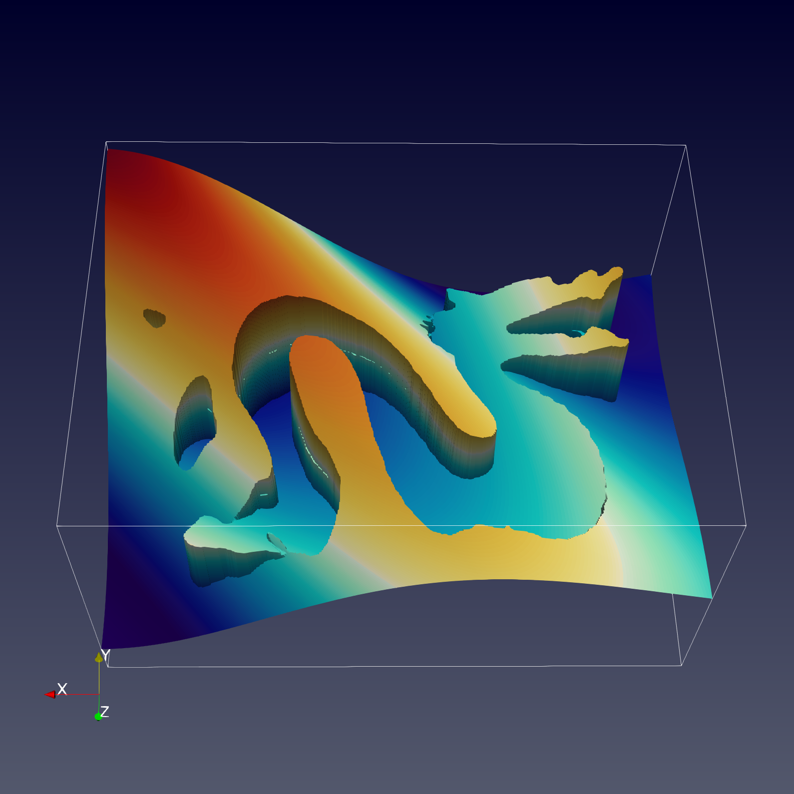

# JAX-DIPS
JAX implementation of a differentiable PDE solver with jump conditions across irregular interfaces in 3D. 

The numerical method is the neural bootstrapping method (NBM):


Streamlines of solution gradients, and jump in solution calculated by the `dragon` example.
<p float="center">
  
   
</p>

<!--  -->


<!-- Advection of the level-set function by a semi-Lagrangian scheme with Sussman reinitialization on a uniform mesh with `128*128*128` grid points is demonstrated below. Note the minimal mass-loss in the level-set function after a full rotation. -->
<!--  -->

<!--  -->

# Testing
Do `pytest tests` from parent directory and a suite of tests will run:
- `test_advection_semi_lagrangian`: a sphere is rotated 360 degrees around the box to replicate initial configuration. The L2 error in level-set function should be less than 1e-4 to pass. The advection is performed using semi-Lagrangian scheme with Sussman reinitialization.
- `test_reinitialization`: starting from a sphere level-set function with -1 inside sphere and +1 outside, we repeatedly perform Sussman reinitialization until the signed-distance property of the level-set is achieved. Center of the box should have level-set value equal to radius of the sphere, and corner of the box should be at a pre-specified distance to pass.
- `test_geometric_integrations`: integrating surface area of a sphere along with its volume. Small differences with associated theoretical values are expected to pass.
# Pre-req

## Nvidia Driver

```
apt install $(nvidia-detector)
```

## Docker Engine

Please refer https://docs.docker.com/engine/install/ubuntu/

## nvidia-docker2

Please refer https://nvidia.github.io/nvidia-docker/ to setup apt repo

apt-get install nvidia-docker2


# Build development container

```
./launch build
```

# Start developement container
This will create a container and places the user in the container with source code mounted.

Once the container is created, user can attach to this container from VS code.

```
./launch dev
```

You can also run the container in background, by passing the `-d` flag for daemon:

```
./launch dev -d
```

You can attach to the running `jax_dips` container by 

```
./launch attach
```


# Copyright
All rights reserved. 
