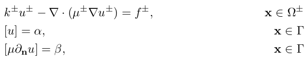

<h1 align='center'>JAX-DIPS</h1>
<h2 align='center'>JAX implementation of a differentiable PDE solver with jump conditions across irregular interfaces in 3D.</h2>

JAX-DIPS implements the [neural bootstrapping method (NBM)](https://arxiv.org/abs/2210.14312) (see citations below) to train compact neural network surrogate models by leveraging efficient finite discretization methods for treatment of spatial gradients as well as automatic differentiation for training neural network parameters. 

- Compact models: contrary to other training methods, we show complex solutions can be learned by shallow and compact neural networks with 1000x less trainable parameters when using finite discretization residuals for training the networks.

- Performance: Use of FD for computing the PDE residuals limits automatic differentiation to ONLY first-order AD, which significantly reduces the computational/memory costs associated to evaluating loss of higher order PDEs (as in PINNs). We achieve 10x speedup compared to backpropagation-based solvers.

- Accuracy: Moreover, use of carefully designed numerical discretization schemes (for example see [Gibou, Fedkiw, and Osher 2018](https://www.sciencedirect.com/science/article/abs/pii/S0021999117307441)) for treating spatial gradients at the presence of discontinuities and irregular interfaces informs the neural network about the mathematical symmetries and constraints (e.g., conservation laws enforced through finite volume discretizations) in local neighborhoods/voxels centered at training points. These extra mathematical constraints improve regularity and accuracy of the learned neural surrogate models for PDEs in three spatial dimensions.

- Cross pollination of applied mathematics and machine learning: JAX-DIPS makes it possible to leverage advanced preconditioners (for example see algebraic multigrid - AMG - preconditioner in [hypre](https://github.com/hypre-space/hypre)) developed in the high performance scientific computing community for faster and more accurate training of neural network models.


## Quick Example
The Poisson solver provides an interface to pass in functions defining different terms of the interfacial PDE given in the form 
<p float="center">
  
</p>


```python
from jax_dips.solvers.poisson import trainer

init_fn = trainer.setup(
    initial_value_fn,
    dirichlet_bc_fn,
    phi_fn,
    mu_m_fn,
    mu_p_fn,
    k_m_fn,
    k_p_fn,
    f_m_fn,
    f_p_fn,
    alpha_fn,
    beta_fn,
    nonlinear_operator_m,
    nonlinear_operator_p,
)
sim_state, solve_fn = init_fn(
    lvl_gstate=gstate_lvl,
    tr_gstate=gstate_tr,
    eval_gstate=eval_gstate,
    num_epochs=num_epochs,
    batch_size=batch_size,
    multi_gpu=multi_gpu,
    checkpoint_interval=checkpoint_interval,
    results_dir=log_dir,
    optimizer_dict=optim_dict,
    model_dict=model_dict,
)
sim_state, epoch_store, loss_epochs = solve_fn(sim_state=sim_state)
```
# Library Structure


Streamlines of solution gradients (left), and jump in solution (right) calculated by the `dragon` example.
<p float="center">
  
  
</p>

<!--  -->


<!-- Advection of the level-set function by a semi-Lagrangian scheme with Sussman reinitialization on a uniform mesh with `128*128*128` grid points is demonstrated below. Note the minimal mass-loss in the level-set function after a full rotation. -->
<!--  -->

<!--  -->


## Models
Models are stored at `jax_dips.nn` module and provided to the Poisson solver through the `get_model(**model_dict)` API defined in `jax_dips.nn.configure` module. When adding a new model you should only add it to this API. The model parameters (i.e., `model_dict`) should be provided to the `jax_dips.solvers.poisson.trainer` module, and is usually defined in the yaml configuration file for hydra similar to:
```
model:
  model_type : "mlp"
  mlp:
    hidden_layers_m: 1
    hidden_dim_m: 3
    activation_m: "jnp.tanh"
    hidden_layers_p: 2
    hidden_dim_p: 10
    activation_p: "jnp.tanh"
  resnet:
    res_blocks_m : 3
    res_dim_m : 40
    activation_m : "nn.tanh"
    res_blocks_p : 3
    res_dim_p : 80
    activation_p : "nn.tanh"
```

## Optimizers
Explicit and implicit auto-differentiation is provided through the `jaxopt` and `optax` packages (`optax` is configured from `jax_dips.solvers.optimizers` module; currently calls to `jaxopt` are configured directly by the `jax_dips.solvers.poisson.trainer` module). In the yaml file this can be configured by
```
solver: 
  optim:
      optimizer_name: "custom" # options are "custom", "adam", "rmsprop", "lbfgs"
      learning_rate: 1e-3
      sched:  # learning rate scheduler 
        scheduler_name: "exponential" # options are "exponential", "polynomial"
        decay_rate: 0.9
```
Currently, choosing `lbfgs` prompts the `jaxopt` package with implicit differentiation.

Note: in the current version we support data-parallel training using `optax`.


# Testing
Do `pytest tests/test_*.py` of each of the available tests from the parent directory:
- `test_advection`: a sphere is rotated 360 degrees around the box to replicate initial configuration. The L2 error in level-set function should be less than 1e-4 to pass. The advection is performed using semi-Lagrangian scheme with Sussman reinitialization.
- `test_reinitialization`: starting from a sphere level-set function with -1 inside sphere and +1 outside, we repeatedly perform Sussman reinitialization until the signed-distance property of the level-set is achieved. Center of the box should have level-set value equal to radius of the sphere, and corner of the box should be at a pre-specified distance to pass.
- `test_geometric_integrations`: integrating surface area of a sphere along with its volume. Small differences with associated theoretical values are expected to pass.
- `test_poisson`: tests for both the pointwise and the grid-based Poisson solvers over a star and a sphere interfaces. Note that in the current implementation the grid-based solver does not support batching and is therefore faster. Fixing this issue will be done in the future versions.

# Installation
To install the latest released version from PyPI do ```pip install jax-dips```. If you want to create a dedicated virtual environment for jax-dips you could use ```python3 -m venv <my-virtual-env>``` and then activate it by ```source <my-virtual-env>/bin/activate```. Then you can install jax-dips inside this environment to make sure it doesn't interfere with your existing library installations. Note `jax-dips` will install jax on your machine, therefore it is recommended to use a virtual environment.


# Development & Usage

## 0. Hardware Requirements
The default hardware requirements considered below is on NVIDIA GPU with CUDA version `>=12.*` and CUDA driver version `>=530`. However, if you are using a different CUDA version you should replace the python wheel address on the first line of `requirements.txt` with your desired `wheel` from https://storage.googleapis.com/jax-releases/jax_cuda_releases.html. If you are using a different hardware (AMD GPU, TPU, etc.) you can also modify the `requirements.txt` accordingly or build from source (modify `Dockerfile`) based on the instructions at https://jax.readthedocs.io/en/latest/developer.html#building-from-source. If you are facing issues with installation please don't to raise an issue at https://github.com/JAX-DIPS/JAX-DIPS/issues and we will add support for your special hardware.

## 1. Virtual Environment
Create a virtual environment by running the following command
```
./create_virtualenv.sh
```
and the ```env_jax_dips``` virtual environment will be created. Then you can launch into this environment by 
```source env_jax_dips/bin/activate```. After you are done, ```deactivate```.

## 2. Docker
Docker images provide an isolated and consistent runtime environment, ensuring that the application behaves the same regardless of the host system. We recommend using the docker image provided here as it is fully loaded with libraries for datacenter scale simulatiopns and optimized for NVIDIA GPUs. For a full list of the supported software and specific versions that come packaged with this container image see the Frameworks Support Matrix https://docs.nvidia.com/deeplearning/frameworks/support-matrix/index.html. 
### Prerequisites
First you will need to install the nvidia driver and docker engines:
- Nvidia Driver
  ```
  apt install $(nvidia-detector)
  ```

  Or use `Synaptic` package manager to install `nvidia-driver-535`.

- Docker Engine
  Please refer https://docs.docker.com/engine/install/ubuntu/

- nvidia-docker2
  Please refer https://nvidia.github.io/nvidia-docker/ to setup apt repo
  ```
  apt-get install nvidia-docker2
  ```

### Container Settings
To personalize your development environment you need to set up a `.env` file that contains
```
IMAGE_NAME=docker.io/pourion/jax_dips:latest       # default docker image available for download! Change this if you want to build new docker images and push to your preferred docker registry
DATA_PATH=/data/                                   # default data path inside your docker container, will mirror your DATA_MOUNT_PATH directory
DATA_MOUNT_PATH=/data                              # default data mount path inside your machine, will mirror into your docker container's DATA_PATH directory
RESULT_PATH=/results/                              # default result path inside your docker container
RESULT_MOUNT_PATH=/results/                        # default result mount path inside your machine
REGISTRY=<your-preferred-registry-name>            # (optional) choices are docker.io (default), nvcr.io, ghcr.io, etc.
REGISTRY_USER=<your-registry-username>             # (optional) your username to connect to docker registry
REGISTRY_ACCESS_TOKEN=<your-registry-access-token> # (optional) your access token to connect to docker registry
WANDB_API_KEY=NotSpecified                         # (optional) your API key to connect to Weights and Biases service
JUPYTER_PORT=8888                                  # (optional) port to connect to jupyter server
```

#### Pull development container
Currently the latest docker image available on Docker Hub is available at `docker.io/pourion/jax_dips`. Instead of building the container, you can only pull the latest docker image by running 

```
./launch.sh pull
```
which pulls from docker hub; i.e., equivalent to ```$ docker pull pourion/jax_dips:latest```.
#### Build development container
Alternatively you can build the container by running the following command
```
./launch.sh build
```
In case you want to add additional libraries to your container this is the recommended way.


#### Start developement container
This will create a container and places the user in the container with source code mounted. 

```
./launch.sh dev
```
Additionally, you can run the container in background without having your terminal jump into the container. This can be done by passing the `-d` flag for daemon:
```
./launch.sh dev -d
```

You can always attach your teminal to the running `jax_dips` container by

```
./launch.sh attach
```

#### Development in VS Code 
Once the container is created and is running on your machine, user can attach to this container from VS code; i.e., you need to install Microsoft's `Dev Containers` extension in your VS Code, then `Ctrl+Shift+P` and choose `Dev Containers: Attach to Running Container...`, then choose the `jax_dips` container from the list of running containers on your machine.

## Cite JAX-DIPS
If you use JAX-DIPS in your research please use the following citations:

```bibtex
@article{mistani2022jax,
  title={JAX-DIPS: Neural bootstrapping of finite discretization methods and application to elliptic problems with discontinuities},
  author={Mistani, Pouria and Pakravan, Samira and Ilango, Rajesh and Gibou, Frederic},
  journal={arXiv preprint arXiv:2210.14312},
  year={2022}
}

@article{mistani2022neuro,
  title={Neuro-symbolic partial differential equation solver},
  author={Mistani, Pouria and Pakravan, Samira and Ilango, Rajesh and Choudhry, Sanjay and Gibou, Frederic},
  journal={arXiv preprint arXiv:2210.14907},
  year={2022}
}
```


## Contributing to JAX-DIPS

- **Reporting bugs.** To report a bug please open an issue in the GitHub [Issues](https://github.com/JAX-DIPS/JAX-DIPS/issues).
- **Suggesting enhancements.** To submit an enhancement suggestion, including new features or improvements to existing functionality, let us know by opening an issue in the GitHub [Issues](https://github.com/JAX-DIPS/JAX-DIPS/issues).
- **Pull requests.** If you made improvements to JAX-DIPS, fixed a bug, or added a new example, feel free to send us a pull-request.


## The Team

JAX-DIPS was developed by [Pouria Mistani](http://www.pouriamistani.com) and [Samira Pakravan](https://samirapakravan.github.io/) and [Rajesh Ilango](https://www.linkedin.com/in/rajeshilango/) under the supervision of Prof. [Frederic Gibou](https://sites.me.ucsb.edu/~fgibou/) during 2019-2022 at [University of California Santa Barbara](https://me.ucsb.edu/). This project was partially funded by the [US Office of Naval Research](https://www.nre.navy.mil/).


## License

[LGPL-2.1 License](https://github.com/JAX-DIPS/JAX-DIPS/blob/main/LICENSE.md)
